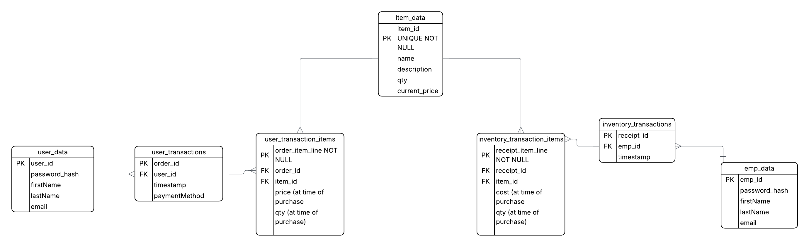

# electric-ecommerce

This project is to showcase my understanding of database design along with using REST API and CRUD methodologies. This will allows users (both customers and employees) to make purchases, update inventory, and keep track of changes. Since this will only be a demo, I will be using JavaScript, sqlite3, and node.js/express.

# Database Schema

This is what my database schema looks like:

I separated the users from the employees as they will have two completely separate functionalities within the system with a similar structure, however I do not want them overlapping.

I will separate my app into 3 layers:

- Data layer -> db.js + queries/
- API layer -> app.js + routes/
- CLI -> cli/

For scalability purposes, I will have 3 routes:

- inventoryRoutes.js - This will handle employee stock orders (**inventory_transactions** and **inventory_receipt_items**)
- itemRoutes.js - This will handle everything related to **item_data**
- orderRoutes.js - This will handle customer orders (**user_transactions** and **user_transaction_items**)

I plan on using bcrypt for password hashing as it is slower for hackers to brute-force their way to finding the password.

I will also use JWT (JSON Web Tokens) to signal to the API whether the user is an employee or a customer throughout the session. This will allow employees to also make customer purchases!
